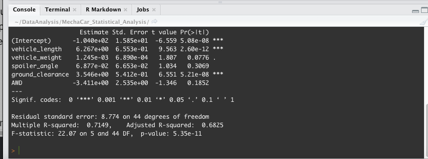
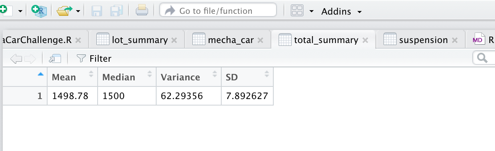
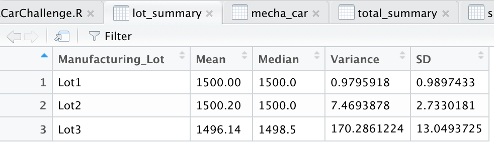
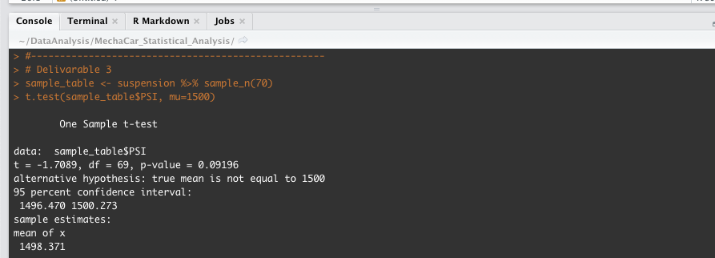
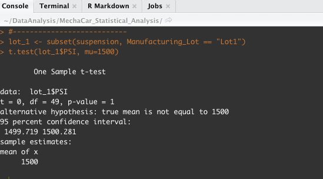
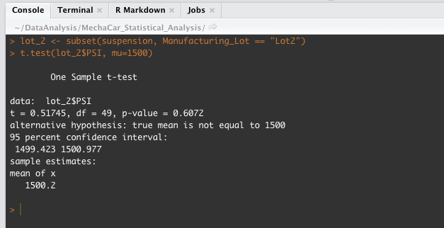
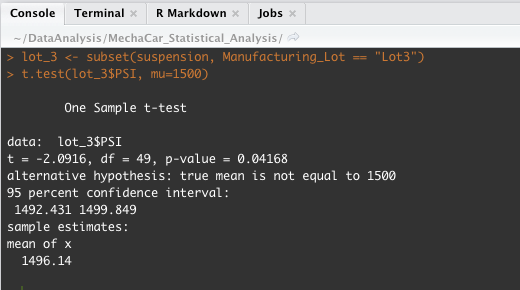

# MechaCar_Statistical_Analysis

## Linear Regression to Predict MPG
#### From the summary() function the Pr(>|t|) value represents the probability that each coefficient contributes a random amount of variance to the linear model. 

### Which variables/coefficients provided a non-random amount of variance to the mpg values in the dataset?
#### And the summary() function on the mecha_car dataset we see that variables vehicle_length and ground_clearance have a significant impact on mpg thus providing non-random amount of variance to the mpg values in the dataset.

### Is the slope of the linear model considered to be zero? Why or why not?
#### There is significant linear relationship, so the dependent value is not determined by random chance and error. Therefore, the slope of the linear model is not zero, or m ≠ 0.

### Does this linear model predict mpg of MechaCar prototypes effectively? Why or why not?
#### The r-squared value is 0.71 which means that roughly 71% of the variablilty of our dependent variable (mpg predictions) is explained using this linear model.Also, our p-value of 2.632e-06 is way less than the assumed significance value of 0.05. Therefore, we can state that there is sufficient evidence to reject our null hypothesis, which means that the slope of our linear model is not zero.

## ------------------------------------------------------------------------------------

## Summary Statistics on Suspension Coils
### Does the current manufacturing data meet this design specification for all manufacturing lots in total?
#### Yes, the current manufaturing data meets the design speciafication for all manufacturing lots in total.

### Does the current manufacturing data meet this design specification for each lot individually? 
#### No. Lot 3 has a variance that is greater than 100. Only Lot 1 and Lot 2 meet the design specification.

## ------------------------------------------------------------------------------------

## T-Tests on Suspension Coils
#### Null hypothesis H0 - There is no statistical difference between the observed sample mean across all manufacturing lots and its population mean.
#### Alternate hypothesis Ha - There is statistical difference between the observed sample mean and its population mean.

#### Assuming our significance level was the common 0.05 percent, our p-value of 0.1 is above our significance level. Therefore, we do not have sufficient evidence to reject the null hypothesis, and we would state that the two means are statistically similar.

## -----------------------------
### Lot_1
#### Null hypothesis H0 - There is no statistical difference between the observed mean in Lot_1 and its population mean.

#### Assuming our significance level was the common 0.05 percent, our p-value of 1 is above our significance level. Therefore, we do not have sufficient evidence to reject the null hypothesis, and we would state that the two means are statistically similar.

## -----------------------------
### Lot_2
#### Null hypothesis H0 - There is no statistical difference between the observed mean in Lot_2 and its population mean.

#### Assuming our significance level was the common 0.05 percent, our p-value of 0.6072 is above our significance level. Therefore, we do not have sufficient evidence to reject the null hypothesis, and we would state that the two means are statistically similar.

## -----------------------------
### Lot_3
#### Null hypothesis H0 - There is no statistical difference between the observed mean in Lot_3 and its population mean.

#### Assuming our significance level was the common 0.05 percent, our p-value of 0.04168 is less than our significance level. Therefore, we have sufficient evidence to reject the null hypothesis, and we would state that the two means are statistically different.

## ------------------------------------------------------------------------------------

## Study Design: MechaCar vs Competition
### What metric or metrics are you going to test?
#### We are considering the following metrics to compare MechaCar vehicles to its competitor:
#### - Cost
#### - Safety rating
#### - City fuel efficiecny 
#### - Highway fuel efficiency.
### What is the null hypothesis or alternative hypothesis?
#### Null hypothesis H0 - The difference between our paired observations of the MechaCar metric and its competitor (the true mean difference, or "μd") is equal to zero.
### What statistical test would you use to test the hypothesis? And why?
#### Two-Sample t-Test (pair t-test) - We are using this test to compare two samples, each from a different population, one MechaCar and the other its competitor. This is known as a pair t-test, because we pair observations in one dataset with observations in another.
### What data is needed to run the statistical test?
#### The paired sample t-test requires the sample data to be numeric and continuous, as it is based on the normal distribution. The metrics we are considering are all numeric and continous. 

